# lineova

Clean, fast charts with good defaults. Lineova has four house styles, handles data of any size, and needs one dependency (NumPy).

```python
import lineova as lv

lv.line(df, x="date", y="sales").save("sales.png")
```

That one call picks the chart size, the ticks and number formats, the colours, the legend (or labels at the line ends), and how to draw the data (vector marks for small data, pixel-exact reduction for millions of points). Every one of those choices can be overridden.

| Folio (academic) | Ledger (enterprise) |
|---|---|
| 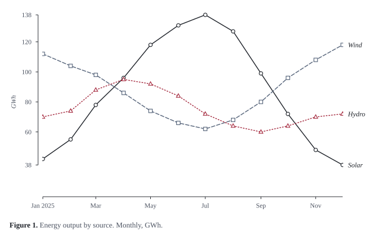 | 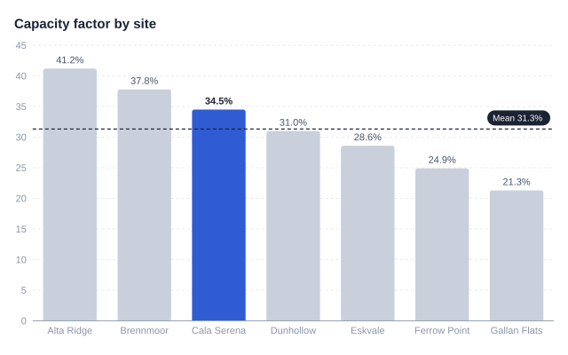 |
| **Instrument (technical)** | **Fjord (reports)** |
| 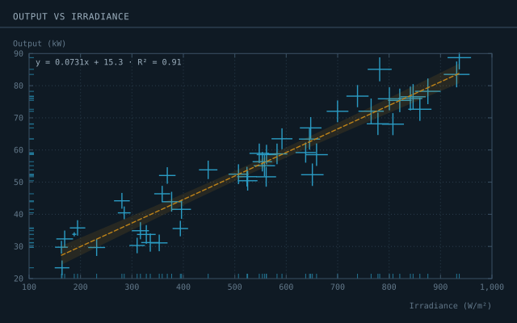 | 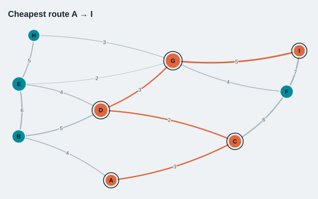 |

## Install

```bash
pip install lineova            # SVG and PDF output
pip install "lineova[png]"     # + PNG output (resvg, no system dependencies)
```

Requires Python 3.10+ and NumPy. pandas and polars inputs work if you have them installed; they are never required.

## Two ways to use it

**1. One call: say what you want and let it decide the rest.**

```python
lv.line(df, x="month", y="gwh")               # grouped automatically by a text column like "source"
lv.bar({"Rome": 34, "Paris": 51, "Oslo": 12})  # sorted, oriented and labelled for you
lv.scatter(df, x="sun", y="kw", size="temp", fit=True)
lv.histogram(values)                          # round-numbered bins chosen from the data
lv.heatmap(matrix)                            # or a DataFrame, or long x/y/value columns
lv.box(df, x="group", y="value")
lv.network(edges, path=("A", "Z"))            # the shortest path is highlighted
lv.area(df, x="month", y="gwh")               # stacked; normalize=True for 100%
```

**2. Chained: set the details you care about, leave the rest on `"auto"`.**

```python
chart = (
    lv.Chart(df, theme="fjord")
      .line(x="month", y="gwh", color="source")
      .title("Energy output", subtitle="GWh per month")
      .y_axis(range=(0, 150), label="GWh", format="{:,.0f}")
      .x_axis(ticks=6)
      .band(x=("2025-06-01", "2025-08-31"), label="Summer")
      .hline(120, "Target")
      .highlight("Solar")
      .legend("top")
      .source("Grid operator")
      .size("wide")
)
chart.save("energy.pdf")
```

Any chained option also works as a keyword in the one-call form (`lv.line(df, y_range=(0, 150), highlight="Solar")`). A typo gets a suggestion: `titel=` → *Did you mean 'title'?*

See **[docs/guide.md](docs/guide.md)** for every option.

## Chart types

| Compare | Distribution | Composition | Change & time | Relationships | Flows & structure | Dashboards |
|---|---|---|---|---|---|---|
| `bar` (grouped, stacked, 100%, error bars) | `histogram` | `pie` / `donut` | `line` (bands) | `scatter` (bubbles, fit, error bars) | `network` | `stat` |
| `dumbbell` | `box` | `treemap` | `area` | `density` (contours) | `sankey` | `sparkline` |
| `slope` | `violin` | `waterfall` | `candlestick` | `heatmap` | `timeline` (Gantt) | `grid` |
| `radar` | `ridgeline` | | `calendar` | | | `facet=` |

| | |
|---|---|
| 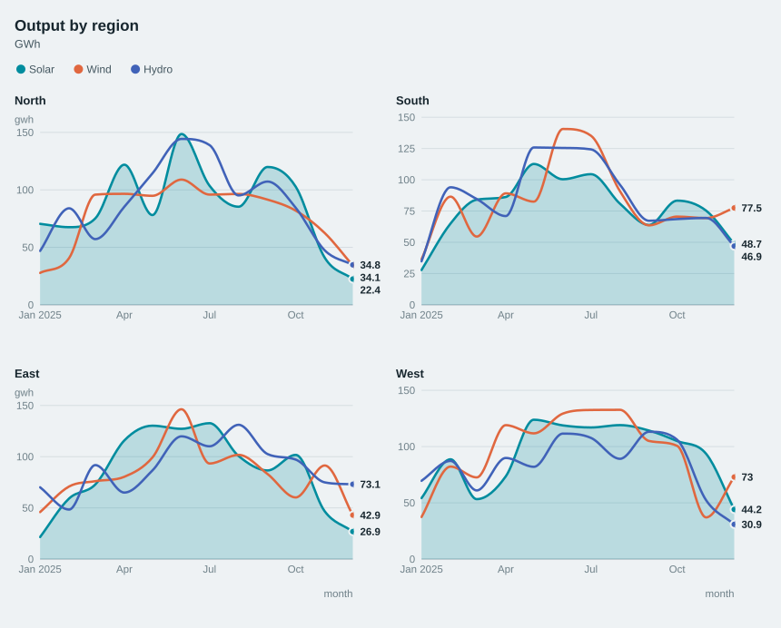 | 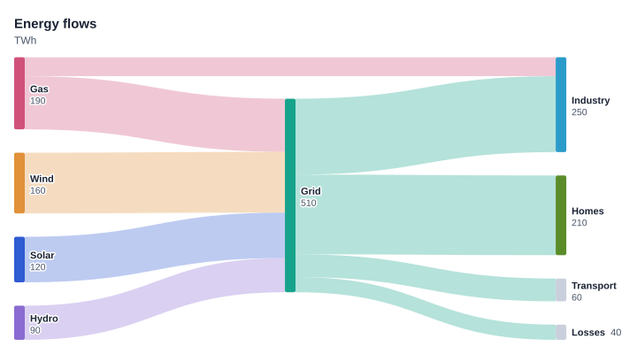 |
| 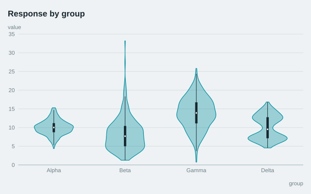 | 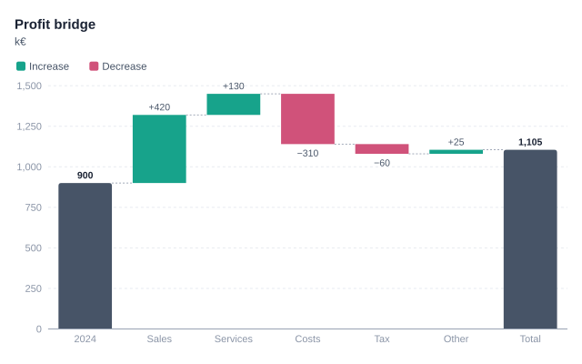 |
| 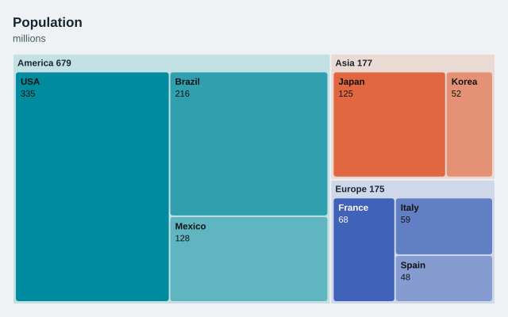 | 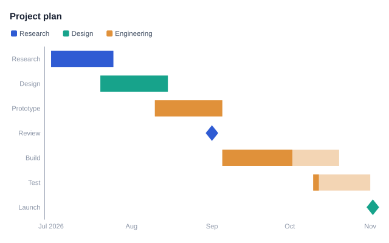 |
| 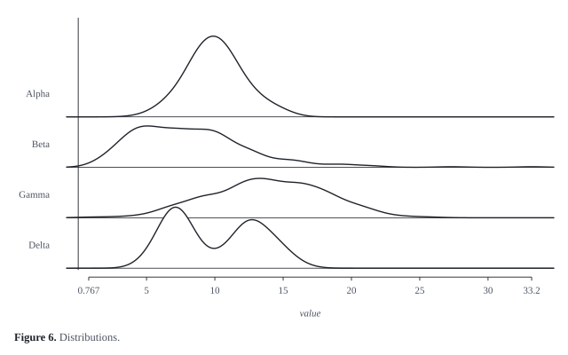 | 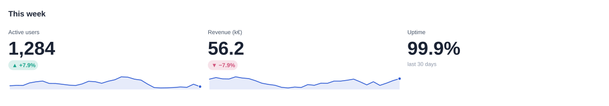 |

### Small multiples and layouts

```python
lv.line(df, x="month", y="gwh", color="source", facet="region")   # one panel per region, shared axes & legend
lv.grid([chart_a, chart_b, chart_c], cols=3, title="This week")     # any charts side by side
```

## Big data

The work a chart does scales with the number of pixels, not the number of rows:

- **Lines** are reduced per pixel column (M4 aggregation: first, last, min, max). The result looks identical to drawing every point.
- **Scatter plots** above 50,000 points switch to a density image. Categories blend their colours, and the axes, labels and legend stay vector.
- **Histograms, heatmaps and box plots** use chunked NumPy passes (`bincount`, block means, partition-based quantiles).
- **Networks** use an FFT-accelerated force layout for large graphs and rasterise the edges when there are too many to draw one by one.

Memory stays bounded because data is processed in chunks. Memory-mapped arrays (`np.memmap`) work directly, and data that doesn't fit in memory at all can be streamed:

```python
batches = lambda: pq.ParquetFile("trips.parquet").iter_batches(columns=["distance"])
lv.histogram(lv.Chunks(batches), x="distance")        # also works for line() and scatter()
```

Measured on a 2-core cloud VM (full pipeline, data → finished SVG):

| Input | Time | SVG size |
|---|---|---|
| line, 10 million points | 0.12 s | 70 KB |
| line, 100 million points | 1.5 s | 70 KB |
| scatter, 10 million points | 0.35 s | 320 KB |
| scatter, 100 million points | 1.9 s | 630 KB |
| histogram, 100 million values | 1.3 s | 20 KB |
| heatmap, 4,000 × 4,000 | 0.5 s | 390 KB |
| network, 40,000 nodes / 200,000 edges | 3 s | 670 KB |
| violin, 10 million values in 5 groups | 1.9 s | 40 KB |
| 2-D density + contours, 10 million points | 0.5 s | 30 KB |
| candlestick, 1 million rows | 0.03 s | 30 KB |
| calendar, 5 million events over 10 years | 0.16 s | 450 KB |
| line from `lv.Chunks`, 20 million rows streamed | 1.1 s | 70 KB |

Run `python benchmarks/bench.py` (add `--big` for 100M) to reproduce.

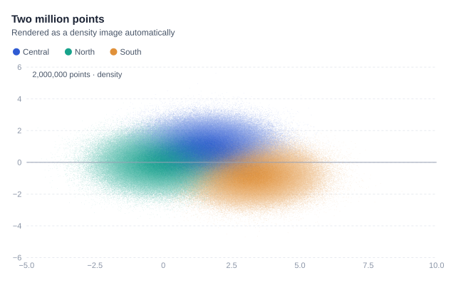

## Output

| Format | How | Notes |
|---|---|---|
| SVG | `.save("x.svg")` / `.to_svg()` | No dependencies. Hover tooltips on marks. |
| PDF | `.save("x.pdf")` / `.to_pdf()` | Built-in vector writer. Text stays selectable. Journal-ready. |
| PNG | `.save("x.png", dpi=300)` | Needs `lineova[png]`, `cairosvg` or `playwright`. Defaults to 2× resolution. |
| HTML | `.save("x.html")` / `.to_html()` | One self-contained file: hover tooltips, scroll to zoom, drag to pan. |
| Jupyter | just display the chart | Rendered inline as SVG. |

## Graphs (the data structure)

```python
g = lv.Graph.from_edges([("A", "B", 4), ("A", "C", 3), ("C", "D", 2)])
g.shortest_path("A", "D")        # ['A', 'C', 'D']
g.bfs("A"), g.dfs("A")
g.connected_components(), g.minimum_spanning_tree(), g.communities()
g.pagerank(), g.betweenness(), g.closeness(), g.max_flow("A", "D"), g.astar("A", "D")
lv.Graph.from_edges(deps, directed=True).topological_sort()
g.draw(path=("A", "D")).save("route.svg")
```

## Themes

`folio` · `ledger` (default) · `instrument` · `fjord`. Themes are plain dataclasses, so you can derive your own:

```python
brand = lv.themes.get("ledger").replace(accent="#0f766e", palette=("#0f766e", "#b45309", "#6d28d9"))
lv.themes.register("brand", brand)
lv.themes.set_default("brand")
```

The categorical palettes were checked for colour-blind separation against each theme's background. Folio also encodes series by line pattern and marker shape, so it survives black-and-white printing.

## Development

```bash
pip install -e ".[dev]"
pytest
python examples/gallery.py        # rebuild the images above
```

MIT licensed. See [ROADMAP.md](ROADMAP.md) for what's next.
