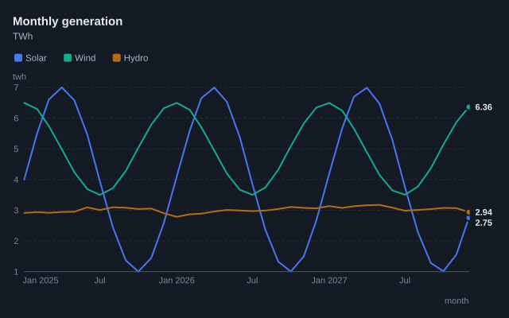
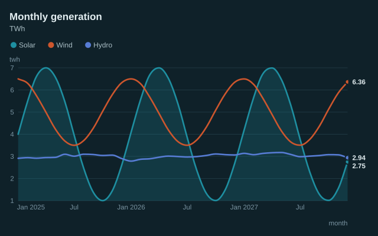
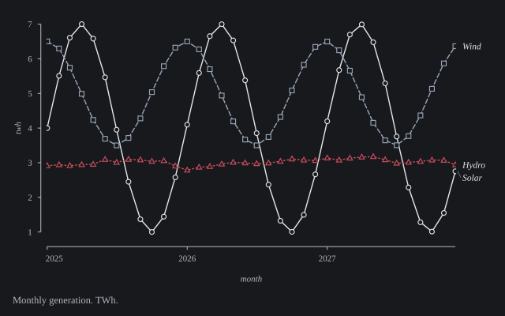
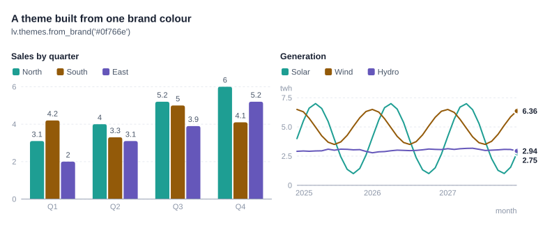

# Themes

A theme holds every visual decision: fonts, colours, axis style, grid, marks, legend style, network drawing and spacing. Charts never hard-code a colour or a font.

| Theme | For | What makes it different |
|---|---|---|
| `folio` | Papers, theses, print | Serif type. Range-frame axes that span only the data. Series told apart by line pattern and marker shape, so figures work in black and white. Direct labels instead of a legend box. Hatching for emphasis. Numbered captions under the figure. Panels labelled (a), (b), (c). |
| `ledger` | Reports, dashboards, slides (default) | Quiet grey structure with one accent colour. Dashed grid. Reference pills. Values printed at line ends. Rounded bar ends. |
| `instrument` | Engineering, monitoring | Dark background, monospace type, boxed frame with inward ticks, dotted measurement grid, a readout panel instead of a legend, rug marks on scatter plots. |
| `fjord` | Public reports, teaching | Soft background, smooth curves, a fill under the lead series, pill-shaped bars with values inside, bubbles, nodes sized by connections. |


### Dark and light variants

| Variant | Of | |
|---|---|---|
| `ledger-dark` | `ledger` |  |
| `fjord-dark` | `fjord` |  |
| `folio-dark` | `folio` |  |
| `instrument-light` | `instrument` | |

Series keep the same hue order as in the original theme, so a chart and its dark version colour each series alike. `lv.themes.dark(name)` and `lv.themes.light(name)` return the counterpart.

## Choosing a theme

```python
lv.line(data, theme="folio")          # one chart
lv.themes.set_default("folio")        # every chart from now on
```

## Making your own

Themes are frozen dataclasses. Derive one with `replace` and register it under a name:

```python
brand = lv.themes.get("ledger").replace(
    accent="#0f766e",
    palette=("#0f766e", "#b45309", "#6d28d9", "#be123c"),
    font="'Inter', 'Helvetica Neue', Arial, sans-serif",
    bar_radius=6,
)
lv.themes.register("brand", brand)
lv.line(data, theme="brand")
```

Frequently changed fields:

| Field | Controls |
|---|---|
| `font`, `font_kind`, `font_size`, `title_size` | Type (`font_kind` is `sans`, `serif` or `mono`, and sets text metrics and the PDF font) |
| `background`, `ink`, `ink_secondary`, `ink_muted` | Surface and text colours |
| `palette`, `accent`, `muted` | Series colours, the highlight colour, and the colour for everything else |
| `sequential`, `diverging` | Colour scales for heatmaps, density and calendars |
| `positive`, `negative` | Increases and decreases (waterfall, candles, stat tiles) |
| `axis_style` | `range`, `baseline`, `box` or `none` |
| `grid`, `grid_dash` | `none`, `x`, `y`, `xy`, and the dash pattern |
| `line_width`, `curve`, `dashes`, `series_markers` | Line drawing |
| `scatter_style` | `solid`, `hollow`, `cross` or `bubble` |
| `legend` | `direct`, `top`, `right` or `readout` |
| `caption_style` | `below` (title at the top) or `figure` (numbered caption underneath) |

The full list is in the [API reference](api.md#themes). Derived themes keep their `family`, the built-in style whose behaviour they inherit.

## A theme from your brand colour

```python
acme = lv.themes.from_brand("#0f766e", base="ledger", name="acme")
lv.bar(data, theme="acme")
lv.themes.from_brand("#0f766e", base="ledger", dark=True, name="acme-dark")
```



Your colour leads the palette. The other colours are generated around the colour wheel at matched lightness, then ordered so neighbours stay apart for colour-blind readers; if eight colours can't pass the checks, you get fewer. Sequential and diverging ramps are built from the same colours.

## Colour

Each categorical palette was checked for:

- a common lightness band, so no series looks faded;
- a chroma floor, so no series reads as grey;
- colour-blind separation between neighbouring colours (protanopia, deuteranopia, tritanopia);
- contrast against the theme's own background.

You can run the same checks on any palette:

```python
print(lv.themes.check_palette(["#2f5bd3", "#17a38b", "#e0913a"], background="#ffffff"))
print(lv.themes.check_palette("ledger-dark"))
```

Warnings (CVD separation between 6 and 8, contrast between 2:1 and 3:1) mean the colours need a second encoding such as direct labels or `texture=True`. Folio intentionally uses near-black and greys: its series are told apart by dashes and markers.

Colours are assigned in a fixed order and follow the series, not its rank, so filtering a chart doesn't repaint the series that remain. Above eight series, the extra series are drawn muted as "Other" with a warning, rather than generating hues that can't be told apart.
