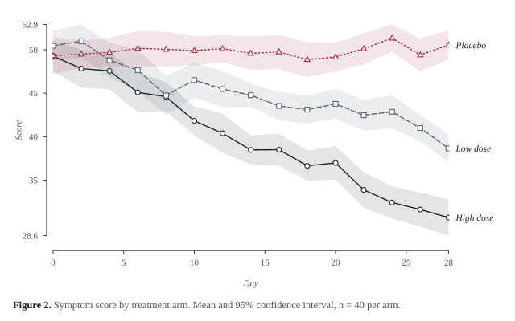
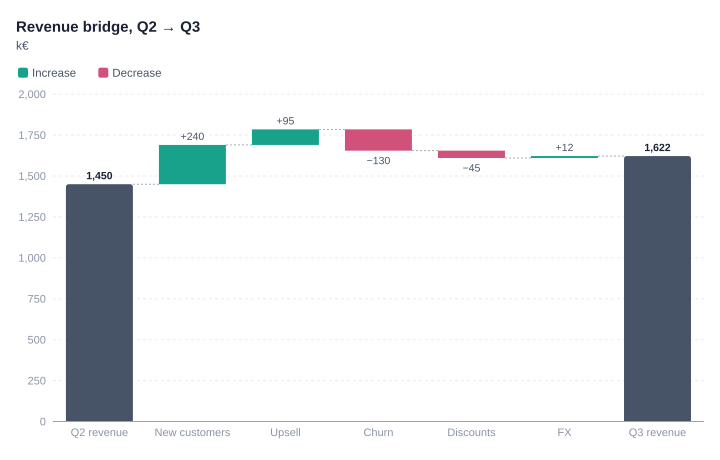
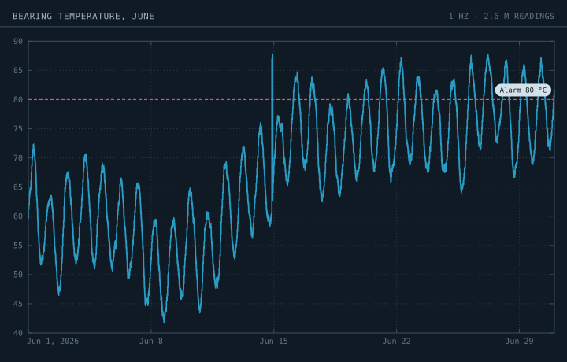
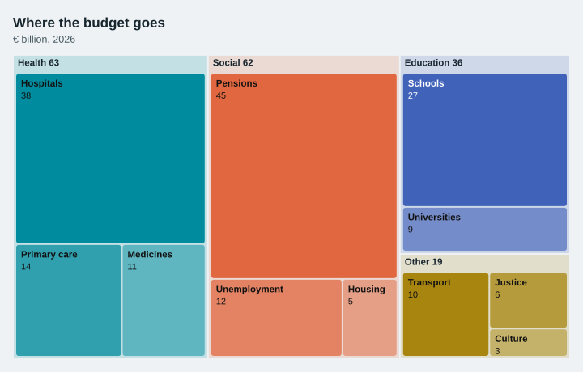
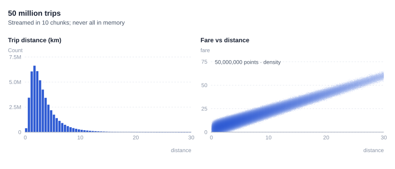
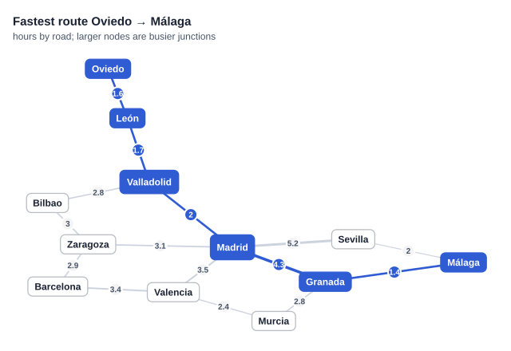

# Use cases

Six complete examples, one per kind of work. The code is taken from [`examples/use_cases.py`](https://github.com/hsilvosa/lineova/blob/main/examples/use_cases.py). Run that file to reproduce every image on this page.

## Academic papers and theses

**Need:** figures that survive black-and-white printing and journal column widths, uncertainty shown honestly, numbered captions, vector output for LaTeX.

**Use:** the `folio` theme (serif type, range-frame axes, series told apart by line pattern and marker as well as colour, direct labels instead of a legend box), `band=` for confidence intervals, `number=` and `caption=` for the figure caption, and PDF output.

```python
import numpy as np
import pandas as pd
import lineova as lv

rng = np.random.default_rng(42)
days = np.arange(0, 29, 2)
trial = pd.DataFrame({
    "day": np.tile(days, 3 * 40),
    "arm": np.repeat(["Placebo", "Low dose", "High dose"], len(days) * 40),
    "score": np.concatenate([
        50 + rng.normal(0, 6, len(days) * 40) - k * np.tile(days, 40) * 0.35 for k in (0, 1, 2)]),
})
summary = trial.groupby(["arm", "day"])["score"].agg(["mean", "sem"]).reset_index()
summary["ci"] = 1.96 * summary["sem"]

fig = lv.line(summary, x="day", y="mean", color="arm", band="ci", theme="folio", number=2,
              title="Symptom score by treatment arm",
              caption="Mean and 95% confidence interval, n = 40 per arm.",
              x_label="Day", y_label="Score")
fig.save("academic.svg")
fig.save("academic.pdf")                  # vector PDF for LaTeX
```



Tips:

- `size="column"` (3.5 in) and `size="page"` match common journal widths.
- `facet="column"` produces panels labelled (a), (b), (c), with shared axes.
- `bar(df, x="group", y="value", agg="mean", error="ci")` gives mean ± 95% CI bars from raw rows.

## Business reports and dashboards

**Need:** numbers someone can read in a few seconds, the one thing that matters highlighted, charts that can be shared as a link or dropped into slides.

**Use:** the `ledger` theme, `stat` tiles with a change arrow and sparkline, `waterfall` for bridges, `highlight=` to mute everything but the point, and `.html` output for an interactive page.

```python
import numpy as np
import pandas as pd
import lineova as lv

rng = np.random.default_rng(42)
weekly = 1180 + np.cumsum(rng.normal(8, 25, 26))
dashboard = lv.grid([
    lv.stat(weekly[-1], label="Active customers", previous=weekly[-5], spark=weekly),
    lv.stat(0.042, label="Churn", previous=0.051, good="down", format="{:.1%}", delta_format="{:.1%}"),
    lv.stat("4.6", label="Satisfaction", note="out of 5, 1,204 answers"),
], cols=3, title="Q3 at a glance", theme="ledger")
dashboard.save("business_kpis.svg")

bridge = lv.waterfall({"New customers": 240, "Upsell": 95, "Churn": -130, "Discounts": -45, "FX": 12},
                      start=("Q2 revenue", 1_450), total="Q3 revenue", theme="ledger",
                      title="Revenue bridge, Q2 → Q3", subtitle="k€")
bridge.save("business_bridge.svg")
bridge.save("business_bridge.html")       # interactive version to share
```




## Engineering and monitoring

**Need:** long, dense time series drawn exactly (every spike visible), thresholds, and screens that are comfortable to leave on.

**Use:** the dark `instrument` theme. Lines of any length are reduced per pixel column (first, last, min and max), so a month of 1 Hz data draws in well under a second and no spike is lost.

```python
import numpy as np
import pandas as pd
import lineova as lv

rng = np.random.default_rng(42)
t = np.arange("2026-06-01", "2026-07-01", dtype="datetime64[s]")
temp = 60 + 8 * np.sin(np.arange(len(t)) / 86400 * 2 * np.pi) + rng.normal(0, 0.6, len(t)).cumsum() * 0.02
temp[1_200_000:1_203_000] += 25                    # a 50-minute overheating event
chart = (lv.Chart(theme="instrument", title="Bearing temperature, June", subtitle="1 Hz · 2.6 M readings")
           .line(x=t, y=temp, label="°C")
           .hline(80, "Alarm 80 °C", color="#d2567f"))
chart.save("engineering.svg")
```



Related charts: `candlestick` for OHLC data (auto-aggregated when zoomed out), `calendar` for daily activity, `density` for where operating points cluster.

## Public reports and teaching

**Need:** charts for readers who aren't analysts: fewer axes, more shape, plain labels.

**Use:** the `fjord` theme with `treemap`, `area`, `slope`, `sankey`, `donut` or `radar`.

```python
import numpy as np
import pandas as pd
import lineova as lv

rng = np.random.default_rng(42)
budget = {"Health": {"Hospitals": 38, "Primary care": 14, "Medicines": 11},
          "Education": {"Schools": 27, "Universities": 9},
          "Social": {"Pensions": 45, "Unemployment": 12, "Housing": 5},
          "Other": {"Transport": 10, "Justice": 6, "Culture": 3}}
lv.treemap(budget, theme="fjord", title="Where the budget goes", subtitle="€ billion, 2026").save("public.svg")
```



## Exploring very large data

**Need:** see the shape of tens or hundreds of millions of rows, possibly more than fits in memory.

**Use:** `lv.Chunks(source)` streams data through `line`, `scatter` and `histogram`. Scatter plots switch to density rendering above 50,000 points. `np.memmap` arrays can also be passed directly.

```python
import numpy as np
import pandas as pd
import lineova as lv

rng = np.random.default_rng(42)
def trips():                                       # stands in for reading Parquet row groups
    g = np.random.default_rng(7)
    for _ in range(10):
        n = 5_000_000
        dist = g.lognormal(1.0, 0.7, n)
        yield {"distance": dist, "fare": 3 + dist * 1.9 + g.normal(0, 2, n)}

lv.grid([
    lv.histogram(lv.Chunks(trips), x="distance", bins=np.arange(0, 30.5, 0.5), title="Trip distance (km)"),
    lv.scatter(lv.Chunks(trips), x="distance", y="fare", title="Fare vs distance", x_range=(0, 30), y_range=(0, 80)),
], cols=2, title="50 million trips", subtitle="Streamed in 10 chunks; never all in memory", theme="ledger") \
    .save("bigdata.svg")
```



With a real Parquet file (requires `pyarrow`):

```python
import pyarrow.parquet as pq
batches = lambda: pq.ParquetFile("trips.parquet").iter_batches(columns=["distance", "fare"])
lv.scatter(lv.Chunks(batches), x="distance", y="fare")
```

## Analysing networks

**Need:** compute things about a network (routes, hubs, clusters) and show the answer.

**Use:** `lv.Graph` for the algorithms and `lv.network` to draw them. See [Graphs](graphs.md).

```python
import numpy as np
import pandas as pd
import lineova as lv

rng = np.random.default_rng(42)
g = lv.Graph.from_edges([
    ("Madrid", "Zaragoza", 3.1), ("Zaragoza", "Barcelona", 2.9), ("Madrid", "Valencia", 3.5),
    ("Valencia", "Barcelona", 3.4), ("Madrid", "Sevilla", 5.2), ("Sevilla", "Málaga", 2.0),
    ("Madrid", "Valladolid", 2.0), ("Valladolid", "Bilbao", 2.8), ("Bilbao", "Zaragoza", 3.0),
    ("Madrid", "Granada", 4.3), ("Granada", "Málaga", 1.4), ("Valencia", "Murcia", 2.4),
    ("Murcia", "Granada", 2.8), ("Valladolid", "León", 1.7), ("León", "Oviedo", 1.6),
])
route = g.shortest_path("Oviedo", "Málaga")
print("Route:", " → ".join(route), f"({g.path_weight(route):.1f} h)")
lv.network(g, path=("Oviedo", "Málaga"), node_size="betweenness", theme="ledger",
           title="Fastest route Oviedo → Málaga", subtitle="hours by road; larger nodes are busier junctions") \
    .save("network.svg")
```


